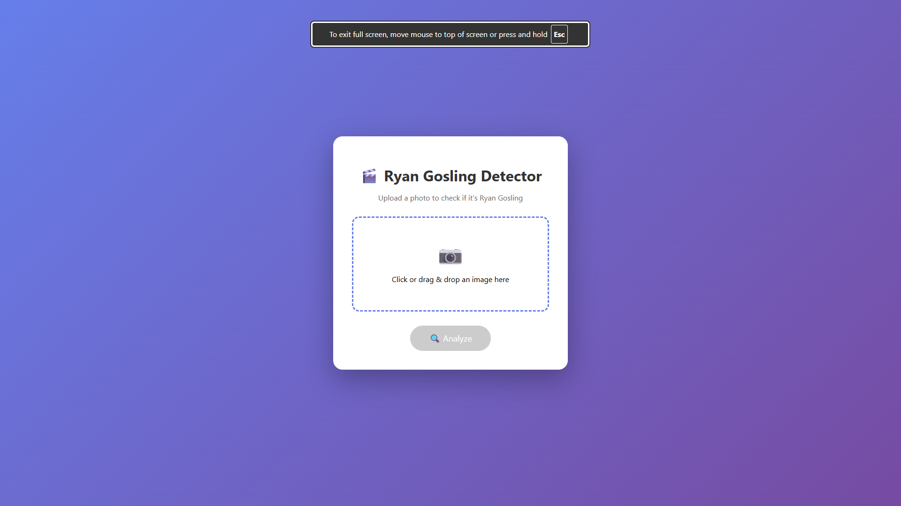
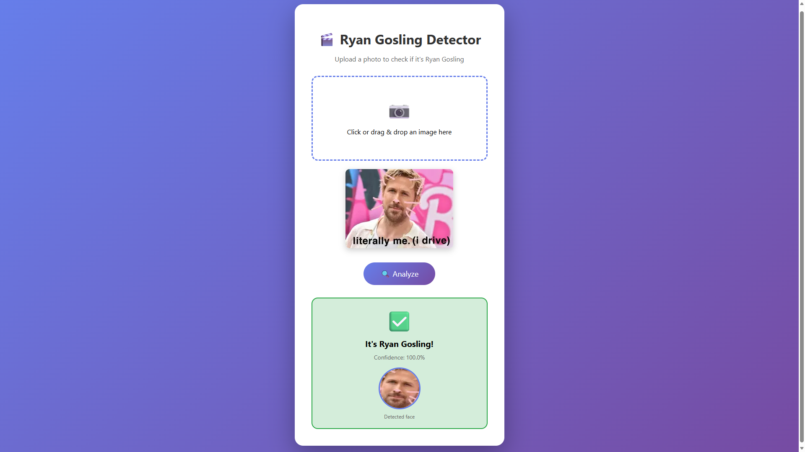
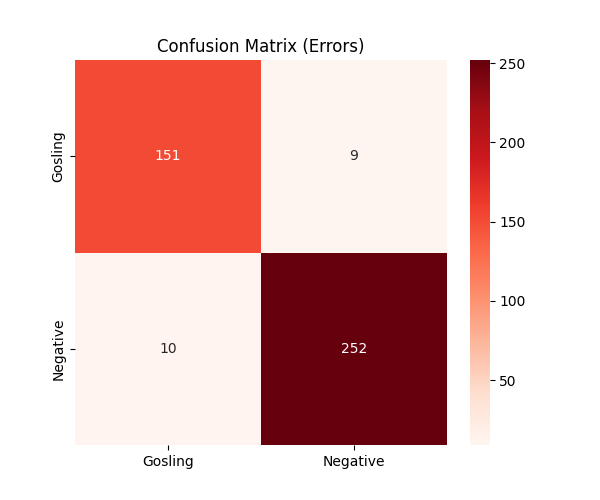

# Ryan Gosling Recognition

A deep learning project that detects whether a face in a photo belongs to **Ryan Gosling**. Built with PyTorch (ResNet-18) and MTCNN for face detection. Includes a FastAPI web interface for real-time predictions.

## Project Structure

```
├── code/
│   ├── api_server.py          # FastAPI web server with UI
│   ├── train.py               # Model training script
│   ├── test.py                # Single image prediction (CLI)
│   ├── test_model.py          # Model evaluation on test set
│   ├── eval_errors.py         # Error analysis (FP/FN)
│   └── best_gosling_model.pth # Trained model weights
├── data-scripts/
│   ├── gosling-download.py    # Download Gosling images via Bing
│   ├── negative-download.py   # Download negative examples
│   ├── detect_faces.py        # Face detection + cropping (MTCNN)
│   ├── clean-images.py        # Remove corrupted images
│   ├── remove-duplicates.py   # Remove duplicate images
│   └── split-dataset.py       # Train/val/test split (70/15/15)
├── docs/
│   └── images/
│       ├── web-ui.png
│       ├── confusion-matrix.png
│       ├── false-positives.png
│       └── false-negatives.png
├── README.md
├── dataset/                   # Split dataset (train/val/test)
├── faces/                     # Cropped faces (gosling/negative)
├── raw_images/                # Raw downloaded images
└── requirements.txt
```

## Setup

**Requirements:** Python 3.10–3.12 (3.13+ is not yet fully supported by PyTorch on Windows)

### 1. Clone the repository

```bash
git clone https://github.com/dackey-wav/gosling-recognition.git
cd gosling-recognition
```

### 2. Create a virtual environment

```bash
python -m venv venv

# Windows
venv\Scripts\activate

# Linux / macOS
source venv/bin/activate
```

### 3. Install dependencies

```bash
pip install -r requirements.txt
```

> **Note:** For GPU support, install PyTorch with CUDA following the
> [official instructions](https://pytorch.org/get-started/locally/) **before**
> running the command above.

## Usage

### Web Interface (FastAPI)

```bash
cd code
uvicorn api_server:app --reload
```

Then open [http://127.0.0.1:8000](http://127.0.0.1:8000) in your browser.

### CLI — Single Image Prediction

```bash
python code/test.py path/to/photo.jpg
```

### Evaluate Model on Test Set

```bash
python code/test_model.py
```

### Error Analysis

```bash
python code/eval_errors.py
```

Results (confusion matrix, false positives/negatives) are saved to `code/analysis_results/`.

## Model

- **Architecture:** ResNet-18 (fine-tuned)
- **Face Detection:** MTCNN (facenet-pytorch)
- **Input:** 224×224 cropped face
- **Output:** Binary classification — Gosling vs Not Gosling

## Screenshots

### Web Interface



### Model Performance


### Error Analysis
| False Positive | False Negative |
|:-:|:-:|
|  |  |

## Data Pipeline

1. **Download** images with `gosling-download.py` / `negative-download.py`
2. **Clean** corrupted files with `clean-images.py`
3. **Remove duplicates** with `remove-duplicates.py`
4. **Detect & crop faces** with `detect_faces.py`
5. **Split** into train/val/test with `split-dataset.py`

## License

This project is for educational purposes.